# Decentralized Cross-Chain Exchange Protocol

---

## Overview

This protocol enables decentralized, secure, and efficient cross-chain token exchanges between different blockchains. Users can exchange tokens without directly interacting with the blockchain, relying on executor nodes to process transactions. The protocol leverages meta-transactions, where users sign messages using **EIP-712**, and nodes execute them by paying for gas fees, which are covered by commissions included in the exchange rate.

---

## Table of Contents

1. [Key Components and Terminology](#key-components-and-terminology)
2. [Protocol Workflow](#protocol-workflow)
   - [1. User Interaction](#1-user-interaction)
   - [2. Node (Executor) Processing](#2-node-executor-processing)
   - [3. Escrow Contract Processing](#3-escrow-contract-processing)
3. [Detailed Steps of the Protocol](#detailed-steps-of-the-protocol)
   - [A. Exchange from Another Chain to Escrow Chain](#a-exchange-from-another-chain-to-escrow-chain)
   - [B. Exchange from Escrow Chain to Another Chain](#b-exchange-from-escrow-chain-to-another-chain)
4. [Consensus Mechanism and Node Interactions](#consensus-mechanism-and-node-interactions)
5. [Security Considerations](#security-considerations)
6. [Conclusion](#conclusion)
7. [Further Considerations](#further-considerations)

---

## Key Components and Terminology

### Components

1. **Users**: Individuals initiating token exchanges.
2. **Executor Nodes (Nodes)**: Stateless functions (e.g., Lambda functions) that process exchange requests, perform blockchain transactions, and participate in consensus.
3. **Frontend Interface**: A user-facing application facilitating exchange initiation, message signing, and interaction with the network.
4. **Smart Contracts**:
   - **Escrow Contracts**: Deployed on specific blockchains (escrow chains) to securely lock and unlock funds based on consensus and transaction validation.
   - **Staking Contract**: Manages the stakes of nodes, serving as collateral against malicious behavior.
5. **Consensus Mechanism**: Ensures nodes agree on transaction states, preventing fraud and resolving conflicts.
6. **Node Discovery via ENS**: Nodes' endpoints are retrieved using **ENS (Ethereum Name Service)** text records.
7. **Protocol Nodes**: Pre-defined nodes within the protocol that serve as the final arbiter in dispute resolutions.

### Terminology

- **Chain**: Any blockchain involved in the exchange. The user can initiate the exchange from any chain, not necessarily the one they want to exchange tokens in.
- **Escrow Chain**: The blockchain where the escrow contract is deployed. This is selected based on factors like transaction fees, compatibility, and support for EVM.
- **Nonce**: A unique number used once, obtained from the escrow contract for each user, to prevent replay attacks.
- **Timestamp**: A time limit for the validity of the signed message (e.g., 20 minutes).

---

## Protocol Workflow

### 1. User Interaction

#### Exchange Configuration

- **User Selection**:
  - **From Chain** and **Token**.
  - **To Chain** and **Token**.
  - **Amount** to exchange.

- **Frontend Calculations**:
  - Retrieves **average exchange rate** from multiple centralized exchanges via API.
  - Calculates **total amount** the user will receive after including commissions.
  - **Node Commission**:
    - User can adjust the percentage to be paid to the node, functioning like **slippage tolerance**.
    - This percentage is used only on the frontend and is included in the final exchange rate presented to the user.
  - The **Final Exchange Rate** includes:
    - Current average exchange rate.
    - Node commission (customizable by the user).
    - Protocol commission.
    - **1% surplus** for unlocking tokens from escrow (if applicable).

- **Display to User**:
  - All calculations and the final exchange rate are transparently shown to the user.

#### Node Discovery and Selection

- **Retrieve Nodes**:
  - Frontend retrieves a list of nodes from the staking contract on the escrow chain.

- **Filter Nodes**:
  - Nodes are filtered to ensure they have sufficient balances and are active.

- **Obtain Node Endpoints**:
  - Nodes' endpoints are obtained from **ENS text records** associated with their addresses.
  - Example code:

    ```javascript
    import { normalize } from 'viem/ens';
    import { publicClient } from './client';

    const ensName = await publicClient.getEnsName({ address: '0xNodeAddress' });
    const ensText = await publicClient.getEnsText({
      name: normalize(ensName),
      key: 'com.exchange',
    });
    // ensText contains the node's RPC-JSON URL
    ```

- **Ping Nodes**:
  - Frontend pings nodes to confirm they are active before including them in the list.

#### Node List Creation

- **Node Array**:
  - An array of node addresses is created from the active nodes.

- **Node List Hash**:
  - The array of node addresses is hashed to produce a **Node List Hash**.
  - This hash will be used for verification by nodes and the escrow contract.

#### Executor Node Calculation

- **Deterministic Selection**

  - The executor node is determined using a deterministic algorithm based on the user's signature and the Node List Hash.

- **Algorithm**

  - Compute a hash using the user's signature:

    ```plaintext
    executor_index = Hash(signature) mod N
    ```

    - **Hash Function**: A secure hash function like SHA-256 or Keccak-256.
    - **N**: Total number of nodes in the array.

  - **Example Code**:

    ```solidity
    // Solidity example
    function deterministicIndex(bytes memory signature, uint256 totalAddresses) public pure returns (uint256) {
        bytes32 hash = keccak256(signature);
        return uint256(hash) % totalAddresses;
    }
    ```

  - **Verification**

    - Since the node list and the algorithm are known, all parties (user, frontend, nodes, escrow contract) can independently calculate and verify the selected executor node.

#### Message Signing

- **First Signature**

  - User signs an **EIP-712** message containing:

    - **Exchange Details**: Amounts, tokens, from chain, to chain.
    - **Node List Hash**: Hash of the node array.
    - **Nonce**: Obtained from the escrow contract for each user.
    - **Timestamp**: To limit the validity time of the signed message (e.g., 20 minutes).
    - Any other necessary data for on-chain verification.

  - **Note**: The node commission percentage is **not** included in the signed message; it is only used on the frontend for exchange rate calculation.

- **Second Signature**

  - For a safe and complete exchange, the user always signs a second message:

    - **If exchanging from the escrow chain**:

      - Authorizes unlocking tokens and returning the 1% surplus.

    - **If exchanging from another chain**:

      - Authorizes spending tokens from the user's balance.

#### Sending the Request

- **Direct Communication**

  - Since the executor node is known, the frontend can send the request directly to the executor.

- **Alternate Communication**

  - Alternatively, the frontend can send the request to any node from the node array.

  - Other nodes, upon receiving the request, can calculate the executor and deliver the request to the executor node.

### 2. Node (Executor) Processing

#### Upon Receiving Data

- **Verify the User's Signature**

  - Validate the **EIP-712** signed message for authenticity and integrity.

- **Verify Executor Selection**

  - Recompute the executor index using the received signature and Node List Hash.

  - Confirm that they are indeed the selected executor node.

- **Request Validity**

  - Check timestamp to ensure the request is within the validity period (e.g., 20 minutes).

  - Check nonce obtained from the escrow contract to prevent replay attacks.

- **Balance Verification**

  - Ensure that the node has sufficient balances on both chains to perform the exchange.

#### Assess Financial Viability

- **Exchange Rate Verification**

  - Evaluate the final exchange rate, including node and protocol commissions.

- **Profitability Check**

  - Determine if executing the exchange is financially beneficial based on current market rates and gas fees.

  - Node decides whether to proceed based on their own criteria.

#### Executing Transactions

- **On the Escrow Chain**

  - If required, lock tokens (amount + 1% surplus) in the escrow contract.

- **On the Other Chain**

  - Submit the user's signed authorization to transfer tokens.

  - Pay for gas fees, which are covered by the commissions.

#### Communication with the User

- **Request Second Signature**

  - If necessary, request the user to sign the second **EIP-712** message (e.g., to authorize token transfer or unlock surplus).

- **Provide Updates**

  - Inform the user about the status of the exchange.

### 3. Escrow Contract Processing

#### Upon Receiving Data

- **Verify the User's Signature**

  - Validate the EIP-712 signed message.

- **Verify Executor Authorization**

  - Recalculate the executor index using the user's signature and Node List Hash.

  - Confirm that the executor is authorized to perform the operation.

- **Transaction Data Verification**

  - Ensure that all transaction data matches exactly:

    - Amounts.

    - Tokens.

    - Chains involved.

    - Nonce and timestamp.

- **Amount Verification**

  - Check that the amounts are correct, including the 1% surplus if applicable.

- **Preventing Replay Attacks**

  - Use nonces and timestamps to prevent replay of messages.

#### Locking and Unlocking Funds

- **Lock Funds**

  - Upon successful verification, lock the tokens in escrow.

- **Unlock Funds**

  - Unlock tokens upon receiving the second signed message from the user or based on consensus outcomes.

#### Dispute Handling

- Acts upon consensus results from nodes in case of disputes.

- Enforces penalties such as forfeiting the surplus or returning funds to the appropriate party.

---

## Detailed Steps of the Protocol

### A. Exchange from Another Chain to Escrow Chain

#### 1. Exchange Initiation

- **User Actions**

  - Configures exchange details on the frontend.

  - Adjusts node commission percentage if desired.

  - Frontend calculates the final exchange rate.

  - User signs the first **EIP-712** message containing:

    - Exchange details.

    - Node List Hash.

    - Nonce obtained from the escrow contract.

    - Timestamp (validity period).

- **Frontend Actions**

  - Retrieves nodes and constructs the node array.

  - Pings nodes to confirm availability.

  - Calculates the executor node based on the signature and Node List Hash.

  - Sends the signed request directly to the executor node.

#### 2. Node (Executor) Processing

- **Verification**

  - Verifies the user's signature.

  - Verifies executor selection.

  - Checks request validity (timestamp and nonce).

- **Assess Financial Viability**

  - Evaluates exchange rates and potential profit.

  - Decides whether to proceed based on profitability.

- **Locks Tokens in Escrow Contract**

  - Sends tokens (amount + 1% surplus) to the escrow contract.

- **Escrow Contract Verifications**

  - Validates the transaction as described in the [Escrow Contract Processing](#3-escrow-contract-processing) section.

  - Confirms successful locking.

- **Requests Second Signature from User**

  - User signs the second **EIP-712** message authorizing the executor to transfer tokens from their balance on the other chain.

  - User sends the signed message directly to the executor.

- **Executor Completes Exchange**

  - Submits the signed authorization to transfer tokens on the other chain.

  - Unlocks the user's tokens from the escrow contract on the escrow chain.

  - Receives the 1% surplus as compensation.

#### 3. User Receives Tokens

- **On the Escrow Chain**

  - User's tokens are unlocked and transferred to their address.

### B. Exchange from Escrow Chain to Another Chain

#### 1. Exchange Initiation

- **User Actions**

  - Configures exchange details on the frontend.

  - Adjusts node commission percentage if desired.

  - Frontend calculates the final exchange rate.

  - User signs the first **EIP-712** message containing:

    - Exchange details.

    - Node List Hash.

    - Nonce obtained from the escrow contract.

    - Timestamp (validity period).

  - This message includes authorization to transfer tokens to the escrow contract.

- **Frontend Actions**

  - Retrieves nodes and constructs the node array.

  - Pings nodes to confirm availability.

  - Calculates the executor node.

  - Sends the signed request directly to the executor node.

#### 2. Node (Executor) Processing

- **Verification**

  - Verifies the user's signature.

  - Verifies executor selection.

  - Checks request validity (timestamp and nonce).

- **Assesses Financial Viability**

  - Evaluates exchange rates and potential profit.

  - Decides whether to proceed based on profitability.

- **Submits User's Signed Message to Escrow Contract**

  - Locks the user's tokens (amount + 1% surplus) in the escrow contract.

- **Escrow Contract Verifications**

  - Validates the transaction.

  - Confirms successful locking.

- **Executor Completes Exchange**

  - Transfers the equivalent tokens to the user's address on the other chain.

- **Requests Second Signature from User**

  - Notifies the user of the transfer and requests the unlock message.

#### 3. User Unlocks Surplus

- **User Signs Second Message**

  - Authorizes the executor to retrieve the 1% surplus from the escrow contract.

  - Sends the signed message directly to the executor.

- **Executor Retrieves Surplus**

  - Submits the unlock message to the escrow contract.

  - Receives the surplus as compensation.

#### 4. User Receives Tokens

- **On the Other Chain**

  - User receives the tokens transferred by the executor.

---

## Consensus Mechanism and Node Interactions

### Executor Node Calculation

- **Algorithm**

  ```plaintext
  executor_index = Hash(signature) mod N
  ```

  - **Hash Function**: A secure hash function like Keccak-256.

  - **N**: Total number of nodes in the array.

- **Verification**

  - All parties can independently calculate and verify the executor node using this algorithm.

### Node Checks Upon Receiving Data

- **Signature Verification**

  - Validate the EIP-712 signatures for authenticity and integrity.

- **Data Integrity**

  - Ensure that the transaction details match the signed message.

- **Executor Verification**

  - Confirm that they are the selected executor node.

- **Request Validity**

  - Check timestamp (within 20 minutes).

  - Verify nonce with the escrow contract.

- **Profitability Assessment**

  - Evaluate the financial benefits of executing the exchange.

### Escrow Contract Checks Upon Receiving Data

- **Signature Verification**

  - Validate the EIP-712 signatures.

- **Executor Authorization**

  - Verify that the executor is authorized based on the Node List Hash and deterministic hash calculation.

- **Transaction Data Verification**

  - Confirm that the transaction details match exactly.

- **Amount Verification**

  - Ensure the amounts are correct, including any surplus.

- **Preventing Replay Attacks**

  - Use nonces and timestamps.

### Handling Unresponsive Nodes

- **Executor Node Unresponsive**

  - If the executor node is unresponsive or fails to act within the validity period (e.g., 20 minutes):

    - **User Decides Next Steps**

      - User may choose to initiate a new exchange with updated parameters.

- **Failed Exchange After Initial Execution**

  - If the exchange is not completed within 1 hour, the deceived party (user or executor) can initiate the consensus mechanism.

### Consensus Mechanism

#### Timeframes

- **0-1 Hour**: The exchange must be completed successfully.

- **1-2 Hours**: The deceived party initiates consensus among nodes from the executor's array (excluding the executor node).

- **2-3 Hours**: If consensus is not reached, the deceived party can initiate consensus with an array of higher reliability and reputation nodes.

- **After 3 Hours**: If consensus is still not reached, protocol nodes specified in the contract decide the consensus.

#### Participants

- **Consensus Nodes**

  - Nodes from the node array participate in the consensus process (excluding the executor node).

#### Motivation

- **Incentive for Participation**

  - Nodes are motivated to participate in consensus to receive a share of the 1% surplus.

#### Process

- **Sequential Communication**

  - Nodes are stateless lambdas; after a node signs its response, it sends it to another node.

- **Reaching Consensus**

  - As soon as a node has a majority of signatures indicating a decision, it can submit the consensus to the escrow contract.

- **Gas Costs**

  - The cost of submitting consensus to the blockchain is covered by a portion of the surplus.

  - The frontend adjusts the surplus percentage to ensure the fee is fully covered.

#### Outcome

- **Escrow Contract Acts Based on Consensus**

  - Funds are released according to the consensus decision.

- **Surplus Distribution**

  - If one party does not complete the exchange, the 1% surplus is equally divided among the consensus participants.

---

## Security Considerations

- **Staking and Slashing**

  - Nodes must stake tokens as collateral.

  - Malicious behavior results in stake slashing.

- **Data Integrity**

  - Use of EIP-712 ensures messages are authentic and unaltered.

- **Replay Protection**

  - Nonces and timestamps prevent replay attacks.

- **Transparency**

  - All calculations and selections are transparent and verifiable by all parties.

- **Fault Tolerance**

  - The protocol handles unresponsive nodes and disputes through consensus mechanisms and escalation to Protocol Nodes.

- **User Control**

  - Users have control over the exchange process and can adjust parameters like node commission.

---

## Conclusion

This decentralized cross-chain exchange protocol provides a secure, efficient, and user-friendly method for exchanging tokens across different blockchains. By utilizing EIP-712 for all signatures and a deterministic executor node selection based on the user's signature and node array, the protocol ensures transparency and verifiability at all stages. Nodes are incentivized to act honestly, and the system is robust against malicious behavior and failures.

---

## Further Considerations

- **Scalability**

  - The protocol can scale by adding more nodes and optimizing communication pathways.

- **User Education**

  - Educating users on the importance of carefully reviewing signing prompts and understanding the process.

- **Open Source Development**

  - Encouraging community involvement for improvements and audits.

- **Regulatory Compliance**

  - Ensuring compliance with financial regulations in relevant jurisdictions.

- **Dynamic Surplus Adjustment**

  - Frontend dynamically adjusts surplus percentages based on exchange amounts and number of nodes to ensure gas costs are covered during consensus.

---

# Protocol Visualization with Diagrams

## Key Components Legend

- **Participants**:
  - **User**: Individual initiating the exchange.
  - **Frontend**: User interface application.
  - **Executor Node**: The node selected to execute the exchange.
  - **Node(s)**: Other nodes participating in consensus.
  - **EscrowContract**: Smart contract on the escrow chain.
  - **ChainA**: Escrow chain (e.g., Ethereum).
  - **ChainB**: Another chain (e.g., Binance Smart Chain).
  - **Protocol Nodes**: Pre-defined nodes for final dispute resolution.

- **Symbols**:
  - **Solid Arrow (`->>`)**: Action or message sent.
  - **Dashed Arrow (`-->>`)**: Response or acknowledgment.
  - **Note**: Additional information or status.
  - **Alt Block**: Alternative paths or conditions.
  - **Loop Block**: Repeated actions.
  - **Opt Block**: Optional actions.

---

## 1. Successful Exchange from Escrow Chain to Another Chain

### Description

- **Scenario**: User wants to exchange tokens from the escrow chain (**ChainA**) to another chain (**ChainB**).
- **Outcome**: Exchange completes successfully; all parties fulfill obligations.

### Diagram

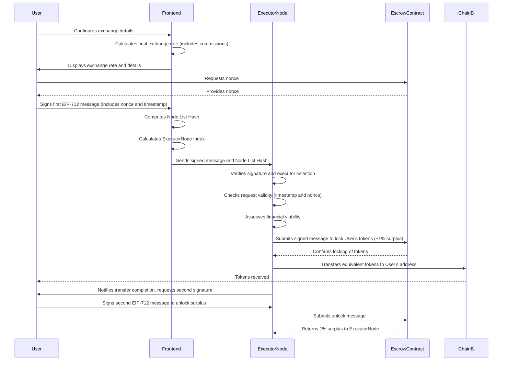

---

## 2. Successful Exchange from Another Chain to Escrow Chain

### Description

- **Scenario**: User wants to exchange tokens from another chain (**ChainB**) to the escrow chain (**ChainA**).
- **Outcome**: Exchange completes successfully; all parties fulfill obligations.

### Diagram

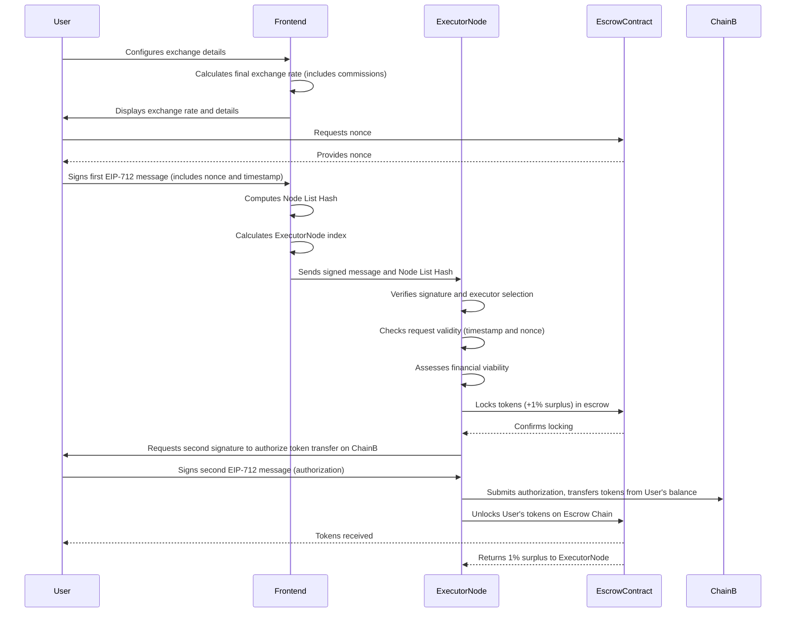

---

## 3. Exchange Requiring Consensus (Escrow Chain to Another Chain)

### Description

- **Scenario**: User exchanges from escrow chain to another chain. User fails to sign the second message to unlock surplus.
- **Outcome**: ExecutorNode initiates consensus; surplus is distributed among participating nodes.

### Diagram

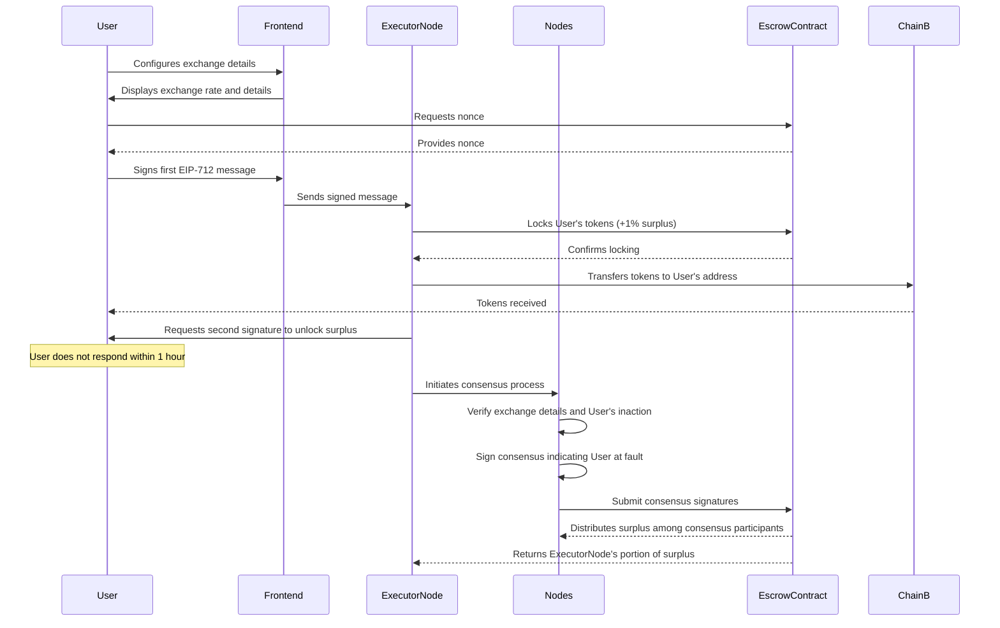

---

## 4. Exchange Requiring Consensus (Another Chain to Escrow Chain)

### Description

- **Scenario**: User exchanges from another chain to escrow chain. ExecutorNode fails to complete token transfer after receiving authorization.
- **Outcome**: User initiates consensus; surplus is distributed among participating nodes; ExecutorNode may face penalties.

### Diagram

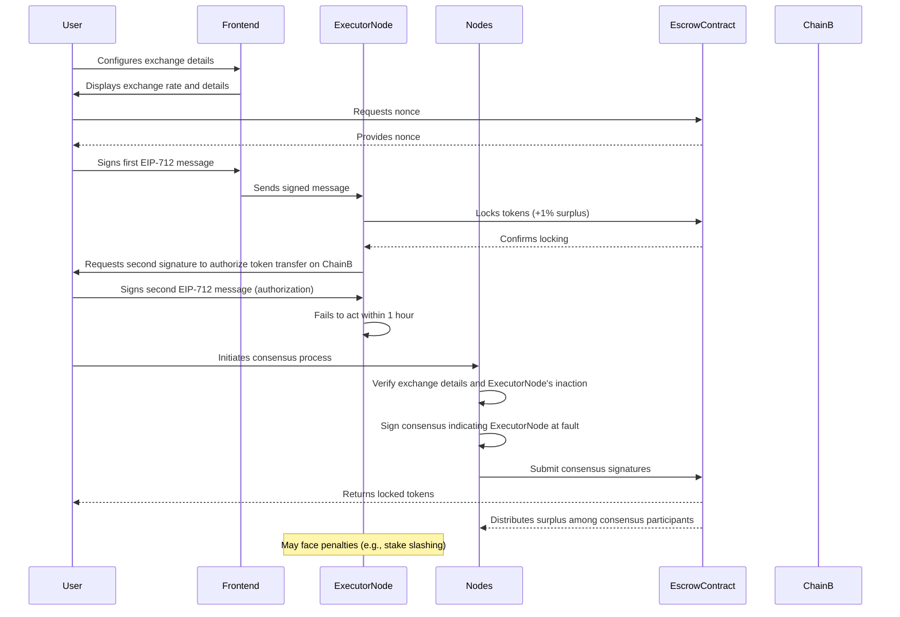

---

## 5. Consensus Escalation Process

### Description

- **Scenario**: Consensus among initial nodes fails; process escalates to higher reliability nodes and eventually to Protocol Nodes.
- **Outcome**: Dispute is resolved at higher levels; surplus is distributed accordingly.

### Diagram

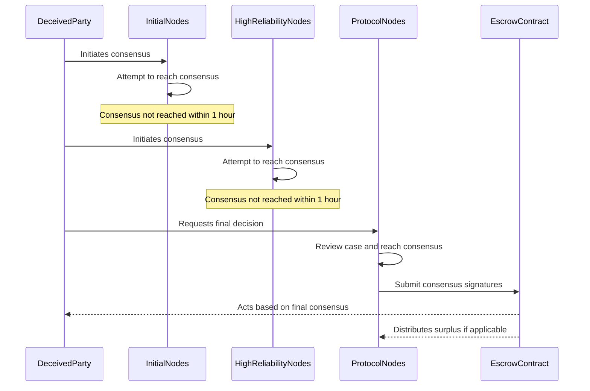

---

## 6. Successful Consensus and Surplus Distribution

### Description

- **Scenario**: Consensus is reached among nodes; surplus is distributed to cover gas costs and incentivize participation.
- **Outcome**: Dispute is resolved promptly; participants receive a share of the surplus.

### Diagram

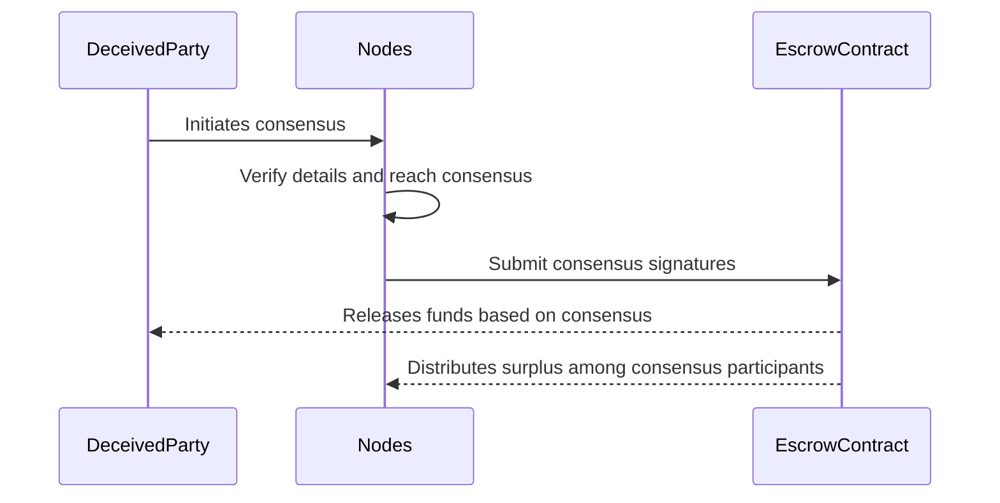

---

## 7. Node Selection and Executor Calculation

### Description

- **Scenario**: Frontend selects active nodes; calculates executor node deterministically.
- **Outcome**: Executor node is selected transparently; all parties can verify the selection.

### Diagram

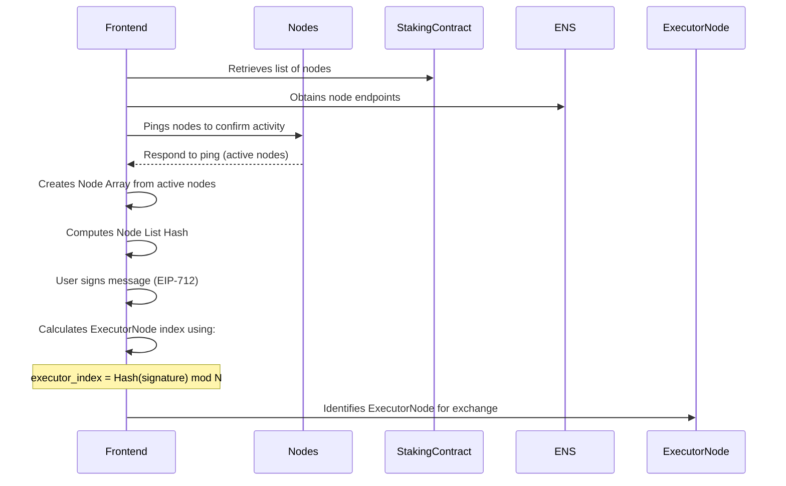

---

## 8. User Adjusts Exchange Parameters Due to Executor Unresponsiveness

### Description

- **Scenario**: Executor node is unresponsive; user decides to adjust exchange parameters or select a different node.
- **Outcome**: User maintains control; can initiate a new exchange.

### Diagram

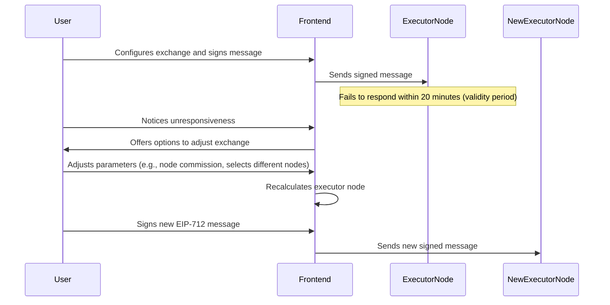

---

## 9. Handling Nonce and Timestamp for Replay Protection

### Description

- **Scenario**: User obtains nonce from EscrowContract; includes timestamp in signed message.
- **Outcome**: Prevents replay attacks; ensures message validity within a time window.

### Diagram

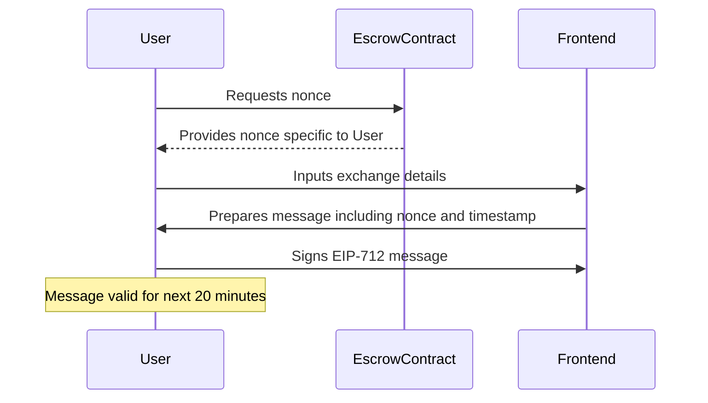

---

## 10. Executor Node Assesses Financial Viability

### Description

- **Scenario**: Executor node evaluates whether executing the exchange is profitable.
- **Outcome**: Node decides to proceed or decline based on profitability.

### Diagram

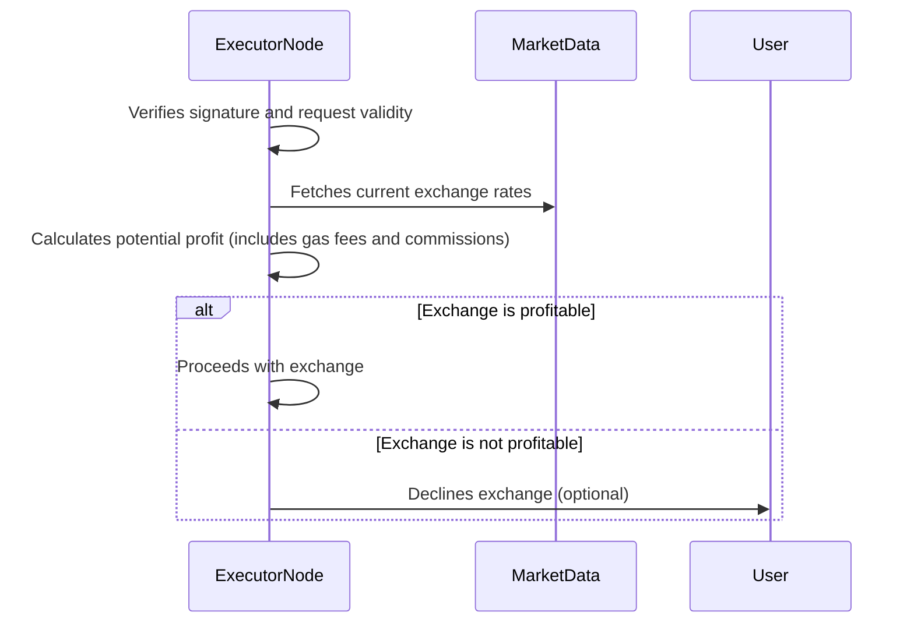

---

## 11. Frontend Adjusts Surplus Percentage Dynamically

### Description

- **Scenario**: Frontend adjusts the surplus percentage to ensure consensus participants are incentivized and gas costs are covered.
- **Outcome**: Exchange parameters are optimized; consensus process remains viable.

### Diagram

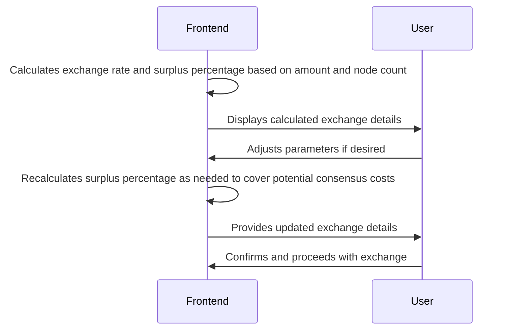

---

## 12. Node Leaves the Network

### Description

- **Scenario**: A node decides to leave the network by zeroing balances, withdrawing stake, and clearing ENS records.
- **Outcome**: Node is no longer selected for exchanges; ensures network reliability.

### Diagram

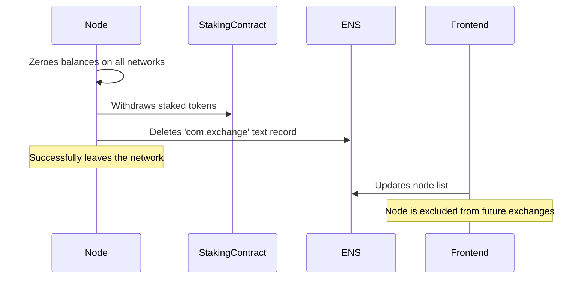

---

## Conclusion

These diagrams visualize the detailed workflow of the decentralized cross-chain exchange protocol, covering both successful exchanges and scenarios requiring the consensus mechanism. By illustrating each step and interaction, the diagrams provide a clear understanding of how the protocol functions in various situations, ensuring transparency and trust among all participants.

