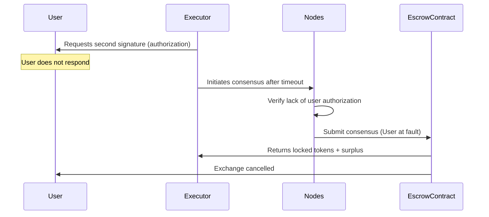
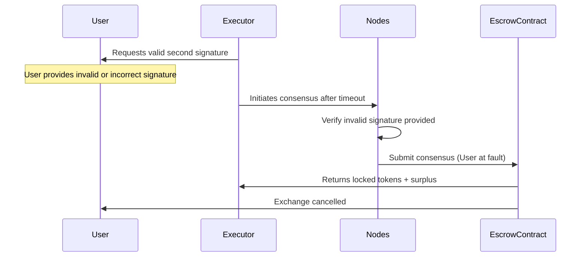
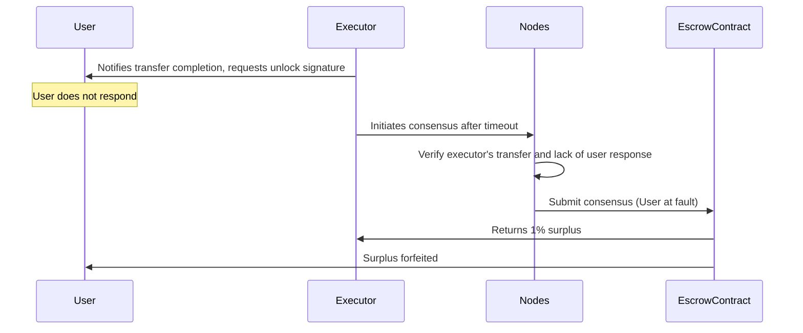
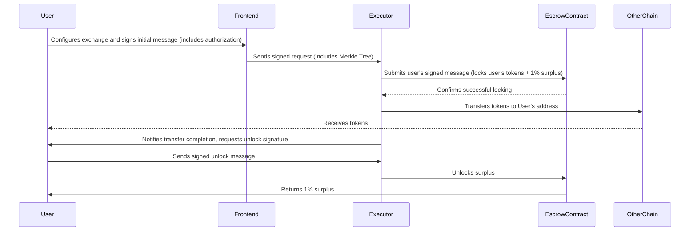
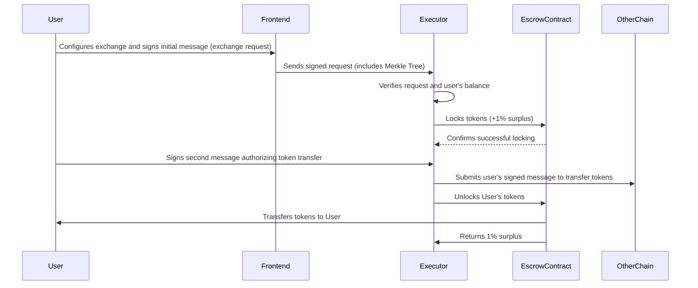

# **rosschain protocol**

## **Overview**

The proposed protocol enables decentralized, secure, and efficient cross-chain token exchanges between different blockchains. Users can exchange tokens without directly interacting with the blockchain, relying on nodes (executors) to process transactions. The protocol leverages meta-transactions, where users sign messages, and nodes execute them by paying for gas fees, which are covered by commissions included in the exchange rate.

---

## **Key Components**

1. **Users**: Individuals initiating token exchanges.
2. **Nodes (Executors)**: Stateless functions (e.g., Lambda functions) that process exchange requests, perform blockchain transactions, and participate in consensus.
3. **Frontend Interface**: A user-facing application facilitating exchange initiation, message signing, and interaction with the network.
4. **Smart Contracts**:
   - **Escrow Contracts**: Deployed on specific blockchains (escrow chains) to securely lock and unlock funds based on consensus and transaction validation.
   - **Staking Contract**: Manages the stakes of nodes, serving as collateral against malicious behavior.
5. **Consensus Mechanism**: A protocol ensuring nodes agree on transaction states, preventing fraud and resolving conflicts.

---

## **Terminology**

- **Chain**: Any blockchain involved in the exchange. The user can initiate the exchange from any chain, not necessarily the one they want to exchange tokens in.
- **Escrow Chain**: The blockchain where the escrow contract is deployed. This is selected based on factors like transaction fees and compatibility, and is not always the chain with the lowest fees.

---

## **Protocol Workflow**

### **1. User Interaction**

#### **Frontend Processes**

- **Exchange Configuration**:
  - User selects:
    - **From Chain** and **Token**.
    - **To Chain** and **Token**.
    - **Amount** to exchange.
  - The frontend calculates:
    - **Average exchange rate** from multiple centralized exchanges via API.
    - **Total amount** the user will receive after including commissions.

- **Node Discovery and Selection**:
  - The frontend retrieves a list of nodes from the staking contract on the escrow chain.
  - Nodes are filtered to ensure they have sufficient balances for the exchange.
  - A **Merkle Tree** of node addresses is generated and included in the request.
    - The Merkle Tree is essential for:
      - Determining the executor node via a deterministic hash.
      - Providing nodes with information on where to send results.
      - Ensuring consensus among nodes in case of disputes.

- **Message Signing**:
  - **First Signature**:
    - User signs a message containing:
      - Exchange details (amounts, tokens, chains).
      - Merkle Root of the node list.
      - Timestamp and nonce.
      - Any other necessary data for on-chain verification.
    - Depending on the type of tokens and the exchange direction, the signing method varies:
      - **For ERC-20 Tokens**: Uses `eth_signTypedData_v4` (EIP-712) to sign structured data.
      - **For Native Tokens**: Uses `personal_sign` or `eth_signMessage` to sign a message.
    - This message creates an exchange request and, if necessary, authorizes the transfer of tokens to the escrow contract.
  - **Second Signature**:
    - For a safe and complete exchange, the user always signs a second message:
      - **If exchanging from the escrow chain**:
        - Authorizes unlocking tokens and returning the 1% surplus.
      - **If exchanging from the other chain**:
        - Authorizes spending tokens from the user's balance.

### **2. Node (Executor) Processing**

#### **Structure and Deployment**

- **Stateless Functions**:
  - Nodes are stateless Lambda functions written in **Node.js**.
  - Each node operates via **JSON-RPC** and is invoked through HTTPS requests.
- **Unique Identity**:
  - Each node has a unique private key and blockchain address.
- **Stake Requirement**:
  - Nodes must stake tokens in a staking contract to participate.
  - Stakes serve as collateral against malicious behavior.

#### **Responsibilities**

- **Processing Requests**:
  - Nodes receive exchange requests, including the Merkle Tree of nodes.
  - Verify exchange details and the user's balance (via blockchain data or trusted APIs).
  - Ensure the request is within the validity period.
  - Perform necessary calculations and checks.
- **Executing Transactions**:
  - Depending on the exchange direction, nodes execute transactions on the blockchain:
    - Submit signed messages to the blockchain.
    - Pay for gas fees (covered by the commission included in the exchange rate).
- **Broadcasting Results**:
  - Nodes send results to other nodes specified in the Merkle Tree via HTTPS requests.
- **Consensus Participation**:
  - In case of disputes, nodes participate in the consensus mechanism to resolve conflicts.

### **3. Exchange Scenarios**

#### **A. Exchange from Escrow Chain to Another Chain**

##### **Workflow**

1. **Exchange Initiation**:
   - User signs the first message authorizing the transfer of tokens to the escrow contract.
     - **For ERC-20 Tokens**: Uses `eth_signTypedData_v4`.
     - **For Native Tokens**: Uses `eth_signMessage`.
   - Includes the Merkle Tree in the request.
   - Sends the signed message to a node, which broadcasts it.

2. **Executor Node Selection**:
   - Determined via the deterministic hash of the signed message and Merkle Root.

3. **Executor Node Processing**:
   - Submits the user's signed message to the escrow contract on the **Escrow Chain**, locking the user's tokens (amount + 1% surplus).
     - Escrow contract performs complex checks to ensure:
       - Transaction data matches exactly.
       - The executor is authorized.
       - The amount is correct.
   - Verifies the successful locking before proceeding.

4. **Executor Completes Exchange**:
   - Transfers the equivalent tokens to the user's address on the **Chain**.
   - After the user confirms receipt, they sign the second message to unlock their 1% surplus from escrow.
     - This message is sent directly to the executor.
   - Executor submits this message to the escrow contract, releasing the surplus back to the user.

#### **B. Exchange from Another Chain to Escrow Chain**

##### **Workflow**

1. **Exchange Initiation**:
   - User signs the first message (exchange request).
     - **For ERC-20 Tokens**: Uses `eth_signTypedData_v4`.
     - **For Native Tokens**: Uses `eth_signMessage`.
   - Includes the Merkle Tree in the request.
   - Sends the signed message to a node, which broadcasts it.

2. **Executor Node Selection**:
   - Determined via a deterministic hash of the signed message and Merkle Root.

3. **Executor Node Processing**:
   - Verifies the request and the user's balance.
   - Locks tokens (amount + 1% surplus) in the escrow contract on the **Escrow Chain**.
     - Escrow contract performs complex checks to ensure:
       - Transaction data matches exactly.
       - The executor is authorized.
       - The amount is correct.

4. **User Authorization**:
   - User signs the second message authorizing the executor to spend tokens from their balance on the **Chain**.
     - **For ERC-20 Tokens**: Uses `eth_signTypedData_v4`.
     - **For Native Tokens**: Uses `eth_signMessage`.
   - This message includes necessary data (e.g., nonce from the escrow contract) and is sent directly to the executor.

5. **Executor Completes Exchange**:
   - Submits the signed message to the blockchain, transferring tokens from the user's balance to the executor's address.
   - Unlocks the user's tokens from the escrow contract on the **Escrow Chain**.
   - Receives the 1% surplus as compensation.

---

## **Merkle Tree and Node Communication**

- **Merkle Tree Transmission**:
  - The Merkle Tree is included with each request.
  - Nodes use it to:
    - Verify the list of authorized nodes.
    - Know where to send results or participate in consensus.
- **Node Communication**:
  - Nodes communicate via HTTPS requests to the endpoints specified in the Merkle Tree.
  - Since nodes are stateless, they rely on data in the requests and do not store information between invocations.
  - This approach suits Lambda functions that operate via JSON-RPC.

---

## **Escrow Contract**

- **Deployment**:
  - Deployed on the **Escrow Chain**, which is selected based on factors like transaction fees and compatibility.
- **Functionality**:
  - Performs complex checks of signed messages to ensure:
    - Transaction data matches exactly.
    - The executor is authorized.
    - The amount is correct, no more or less.
  - Locks and unlocks funds based on transaction progress and consensus outcomes.
- **Verification**:
  - Uses on-chain verification to confirm that the signed messages are valid.
  - Validates that the executor node is correctly selected based on the Merkle Root and the deterministic hash.
- **Dispute Handling**:
  - Acts upon consensus results from nodes in case of disputes.

---

## **Consensus Mechanism**

- **Triggering Event**:
  - If an exchange is not completed within a specified timeframe (e.g., 1 hour), the consensus mechanism is initiated.
- **Participants**:
  - Nodes listed in the Merkle Tree for that exchange.
- **Voting Process**:
  - Nodes independently verify the transaction history.
  - Nodes sign messages indicating whether the user or executor is at fault.
- **Consensus Threshold**:
  - Typically, a two-thirds majority is required to make a decision.
- **On-Chain Enforcement**:
  - The aggregated consensus is submitted to the escrow contract.
  - The contract verifies signatures and acts accordingly.
  - Malicious nodes can have their stakes slashed if they make unfair decisions.
- **Preventing Unfair Consensus**:
  - Nodes are incentivized to act honestly due to staking.
  - Malicious behavior leads to stake slashing and loss of reputation.

---

## **Meta-Transactions and EIPs**

- **Meta-Transactions**:
  - Users sign messages authorizing actions.
  - Nodes execute these messages on-chain, paying for gas fees.
  - This allows users to interact without holding native tokens for gas.
- **Relevant EIPs**:
  - **EIP-712**: Defines a standard for typed structured data hashing and signing.
    - Used for `eth_signTypedData_v4` when authorizing ERC-20 token transfers.
  - **EIP-2612**: Adds `permit` function to ERC-20 tokens for gasless approvals (relevant for tokens that support it).
  - **Personal Sign (eth_signMessage)**:
    - Used when authorizing transfers of native tokens (e.g., ETH).

---

## **Security Considerations**

- **Staking and Slashing**:
  - Nodes must stake tokens as collateral.
  - Malicious nodes risk losing their stake.
- **Data Integrity**:
  - All messages are signed and verified using digital signatures.
  - Nonces and timestamps prevent replay attacks.
- **Fault Tolerance**:
  - The network can handle node failures through redundancy and consensus.
- **Reputation System**:
  - Nodes build reputation based on successful exchanges.
  - Reputation affects node selection and trustworthiness.

---

## **Technologies Used**

- **Blockchain Platforms**:
  - **Chains**: Any EVM-compatible blockchain (e.g., Ethereum, Avalanche, Binance Smart Chain, Arbitrum).
  - **Escrow Chain**: Selected based on transaction fees and compatibility; not necessarily the chain with the lowest fees.
- **Smart Contracts**:
  - Written in **Solidity**.
  - Include the **Escrow Contract** and **Staking Contract**.
- **Frontend Technologies**:
  - **React 19 RC** with **shadcn/ui** and **tailwindcss**.
  - **wagmi v2** for blockchain interactions.
  - **Axios** or **Fetch API** for API calls.
- **Nodes (Executors)**:
  - Written in **Node.js**.
  - Deployed as stateless Lambda functions.
- **Communication Protocols**:
  - **HTTPS Requests** via **JSON-RPC**.
  - Nodes use endpoints provided in the Merkle Tree.
- **Cryptography**:
  - **ECDSA** for digital signatures.
  - **Merkle Trees** for efficient verification.

---

## **Scenarios and Resolutions with Diagrams**

### **Scenario 1: User Does Not Sign Second Message**

#### **Description**

- **Context**:
  - **Exchange Direction**: From another chain to the escrow chain.
  - Executor has locked tokens in escrow on the **Escrow Chain**.
  - User does not sign the second message authorizing the executor to spend tokens from their balance on the other chain.

#### **Resolution**

1. **Timeout Trigger**:
   - After 1 hour, the executor initiates the consensus mechanism.

2. **Consensus Process**:
   - Nodes verify that the user did not provide the necessary authorization.
   - Nodes sign messages indicating that the user is at fault.

3. **Escrow Action**:
   - Escrow contract receives the consensus.
   - Executor retrieves their locked tokens and receives the 1% surplus.
   - User does not receive the exchanged tokens.

#### **Diagram**

---

### **Scenario 2: Executor Cannot Spend User's Tokens**

#### **Description**

- **Context**:
  - **Exchange Direction**: From another chain to the escrow chain.
  - Executor has locked tokens in escrow on the **Escrow Chain**.
  - Executor cannot spend the user's tokens because the user did not provide a valid second signature or provided an incorrect one.

#### **Resolution**

- This scenario is effectively the same as Scenario 1 because the executor cannot proceed without the user's valid second signature.

1. **Timeout Trigger**:
   - After 1 hour, the executor initiates the consensus mechanism.

2. **Consensus Process**:
   - Nodes verify that the user did not provide a valid second signature.
   - Nodes sign messages indicating that the user is at fault.

3. **Escrow Action**:
   - Escrow contract receives the consensus.
   - Executor retrieves their locked tokens and receives the 1% surplus.
   - User does not receive the exchanged tokens.

#### **Diagram**

---

### **Scenario 3: User Does Not Sign Unlock Message**

#### **Description**

- **Context**:
  - **Exchange Direction**: From escrow chain to another chain.
  - Executor has transferred tokens to the user on the other chain.
  - User does not sign the second message to unlock their surplus from escrow.

#### **Resolution**

1. **Timeout Trigger**:
   - After 1 hour, the executor initiates the consensus mechanism.

2. **Consensus Process**:
   - Nodes verify that the executor completed the transfer.
   - Nodes confirm that the user did not sign the unlock message.
   - Nodes sign messages indicating that the user is at fault.

3. **Escrow Action**:
   - Escrow contract receives the consensus.
   - Executor retrieves the 1% surplus from escrow.
   - User forfeits their surplus.

#### **Diagram**

---

### **Successful Transaction Diagrams**

#### **A. Successful Exchange from Escrow Chain to Another Chain**

#### **B. Successful Exchange from Another Chain to Escrow Chain**

---

## **Ensuring Practical Implementability**

- **Data Inclusion in Signed Messages**:
  - Use of `eth_signTypedData_v4` and `eth_signMessage` allows inclusion of structured data, which can be verified on-chain.
- **Node Availability and Balances**:
  - Frontend selects nodes with sufficient balances from the staking contract.
- **Stateless Node Operation**:
  - Nodes operate in an event-driven manner without persistent storage.
- **Exchange Splitting**:
  - Large exchanges are split into smaller amounts to match node capacities.
- **User Without Gas Tokens**:
  - Users do not need native tokens for gas fees; nodes cover gas costs and are compensated through commissions.
- **Meta-Transaction Implementation**:
  - For **ERC-20 Tokens**:
    - Use EIP-2612 `permit` function if available.
    - Otherwise, use custom smart contracts to handle approvals via signed messages.
  - For **Native Tokens**:
    - Use custom smart contracts that allow users to sign messages authorizing the transfer of native tokens.
    - Nodes execute these messages on-chain, verifying signatures within the contract.

---

## **Conclusion**

The decentralized cross-chain exchange protocol provides a secure, efficient, and user-friendly method for token exchanges across different blockchains. By utilizing meta-transactions, users can participate without holding native gas tokens. The protocol's design ensures fairness through staking, consensus mechanisms, and detailed verification processes. Nodes are incentivized to act honestly, and the system is robust against malicious behavior.

---

## **Further Considerations**

- **Regulatory Compliance**:
  - The protocol should consider compliance with relevant financial regulations in jurisdictions where it operates.
- **User Education**:
  - Users should be informed about the importance of keeping their private keys secure and the implications of signing messages.
- **Open Source Development**:
  - Open sourcing the protocol's code can enhance transparency and encourage community contributions.
- **Continuous Auditing**:
  - Regular security audits of smart contracts and the protocol to ensure safety against new vulnerabilities.

