```mermaid
sequenceDiagram
    participant Node
    participant StakingContract
    participant ENS

    Node->>Node: Zeroes out balances on all networks
    Node->>StakingContract: Claims back staked tokens
    Node->>ENS: Deletes or clears 'com.exchange' text record
    Note over Node: Node successfully leaves the network
    Frontend->>ENS: Fetches updated node list
    Note over Frontend: Node is no longer included in future exchanges
```

# **rosschain protocol**

The proposed protocol enables decentralized, secure, and efficient cross-chain token exchanges between different blockchains. Users can exchange tokens without directly interacting with the blockchain, relying on nodes (executors) to process transactions. The protocol leverages meta-transactions, where users sign messages using **EIP-712**, and nodes execute them by paying for gas fees, which are covered by commissions included in the exchange rate.

---

## **Key Components**

1. **Users**: Individuals initiating token exchanges.
2. **Nodes (Executors)**: Stateless functions (e.g., Lambda functions) that process exchange requests, perform blockchain transactions, and participate in consensus.
3. **Frontend Interface**: A user-facing application facilitating exchange initiation, message signing, and interaction with the network.
4. **Smart Contracts**:
   - **Escrow Contracts**: Deployed on specific blockchains (escrow chains) to securely lock and unlock funds based on consensus and transaction validation.
   - **Staking Contract**: Manages the stakes of nodes, serving as collateral against malicious behavior.
5. **Consensus Mechanism**: A protocol ensuring nodes agree on transaction states, preventing fraud and resolving conflicts.
6. **Node Discovery via ENS**: Nodes' endpoints are retrieved using **ENS (Ethereum Name Service)** text records.

---

## **Terminology**

- **Chain**: Any blockchain involved in the exchange. The user can initiate the exchange from any chain, not necessarily the one they want to exchange tokens in.
- **Escrow Chain**: The blockchain where the escrow contract is deployed. This is selected based on factors like transaction fees, compatibility, and support for EVM, and is not always the chain with the lowest fees.

---

## **Protocol Workflow**

### **1. User Interaction**

#### **Frontend Processes**

- **Exchange Configuration**:
  - User selects:
    - **From Chain** and **Token**.
    - **To Chain** and **Token**.
    - **Amount** to exchange.
  - The frontend calculates:
    - **Average exchange rate** from multiple centralized exchanges via API.
    - **Total amount** the user will receive after including commissions.
  - **Node Commission Selection**:
    - User can select the **percentage** to be paid to the node, functioning like **slippage tolerance**.
    - This allows the user to set acceptable limits for exchange rates and incentivize nodes to execute the transaction even if rates fluctuate.

- **Node Discovery and Selection**:
  - The frontend retrieves a list of nodes from the staking contract on the escrow chain.
  - Nodes are filtered to ensure they have sufficient balances and are active.
  - Nodes' endpoints are obtained from **ENS text records** associated with their addresses.
    - **Example**:
      ```javascript
      const ensName = await publicClient.getEnsName({ address: '0xNodeAddress' });
      const ensText = await publicClient.getEnsText({
        name: normalize(ensName),
        key: 'com.exchange',
      });
      // ensText contains the node's RPC-JSON URL
      ```
  - **Ping Nodes**:
    - Before interaction, the frontend pings nodes to confirm they are active.
  - Two **Merkle Trees** are generated:
    - **Primary Merkle Tree**:
      - Contains a list of nodes selected for the exchange.
    - **Secondary Merkle Tree**:
      - Contains nodes with higher reliability and reputation, used as a backup in case the primary nodes fail to reach consensus.
  - The Merkle Roots of both trees are included in the request.

- **Message Signing**:
  - All signatures use **EIP-712** (`eth_signTypedData_v4`) for structured data and better user experience in wallets like MetaMask.
  - **First Signature**:
    - User signs a message containing:
      - Exchange details (amounts, tokens, chains).
      - Merkle Roots of both node lists.
      - Timestamp and nonce.
      - Selected node commission percentage.
    - This message creates an exchange request and, if necessary, authorizes the transfer of tokens to the escrow contract.
  - **Second Signature**:
    - For a safe and complete exchange, the user always signs a second message:
      - **If exchanging from the escrow chain**:
        - Authorizes unlocking tokens and returning the 1% surplus.
      - **If exchanging from another chain**:
        - Authorizes spending tokens from the user's balance.

### **2. Node (Executor) Processing**

#### **Structure and Deployment**

- **Stateless Functions**:
  - Nodes are stateless Lambda functions written in **Node.js**.
  - Each node operates via **JSON-RPC** and is invoked through HTTPS requests.
- **Unique Identity**:
  - Each node has a unique private key and blockchain address.
- **Stake Requirement**:
  - Nodes must stake tokens in a staking contract to participate.
  - Stakes serve as collateral against malicious behavior.
- **Node Endpoint Retrieval**:
  - Nodes' endpoints are stored in **ENS text records** under the key `com.exchange`.
  - Nodes can leave the network by:
    1. Zeroing out their balances on all networks.
    2. Claiming back their stake from the staking contract.
    3. Deleting or clearing the `com.exchange` ENS text field.

#### **Responsibilities**

- **Processing Requests**:
  - Nodes receive exchange requests, including the Merkle Trees of nodes.
  - Verify exchange details and the user's balance (via blockchain data or trusted APIs).
  - Ensure the request is within the validity period.
  - Perform necessary calculations and checks.
- **Executing Transactions**:
  - Nodes execute transactions on the blockchain:
    - Submit signed messages to the blockchain.
    - Pay for gas fees (covered by the commission included in the exchange rate).
- **Broadcasting Results**:
  - Nodes send results sequentially to other nodes specified in the Merkle Tree via HTTPS requests.
    - **Sequential Communication**:
      - Since nodes are stateless, communication must be sequential to maintain state across the network.
    - **Handling Non-responsive Nodes**:
      - If a node fails to respond or does not forward the data, the protocol includes mechanisms to bypass or replace the node.
- **Consensus Participation**:
  - In case of disputes, nodes participate in the consensus mechanism to resolve conflicts.

### **3. Exchange Scenarios**

#### **A. Exchange from Escrow Chain to Another Chain**

##### **Workflow**

1. **Exchange Initiation**:
   - User signs the first message authorizing the transfer of tokens to the escrow contract.
   - Includes the Merkle Roots of both node lists.
   - Sends the signed message to the first node in the primary Merkle Tree.
   
2. **Executor Node Selection**:
   - Determined via a deterministic hash of the signed message and Merkle Root.
   - Nodes verify the executor's selection based on the Merkle Tree and message hash.

3. **Executor Node Processing**:
   - Submits the user's signed message to the escrow contract on the **Escrow Chain**, locking the user's tokens (amount + 1% surplus).
   - Escrow contract performs complex checks to ensure:
     - Transaction data matches exactly.
     - The executor is authorized.
     - The amount is correct.
   - Verifies the successful locking before proceeding.

4. **Executor Completes Exchange**:
   - Transfers the equivalent tokens to the user's address on the **Chain**.
   - After the user confirms receipt, they sign the second message to unlock their 1% surplus from escrow.
     - This message is sent directly to the executor.
   - Executor submits this message to the escrow contract, releasing the surplus back to the user.

#### **B. Exchange from Another Chain to Escrow Chain**

##### **Workflow**

1. **Exchange Initiation**:
   - User signs the first message (exchange request).
   - Includes the Merkle Roots of both node lists.
   - Sends the signed message to the first node in the primary Merkle Tree.

2. **Executor Node Selection**:
   - Determined via a deterministic hash of the signed message and Merkle Root.
   - Nodes verify the executor's selection.

3. **Executor Node Processing**:
   - Verifies the request and the user's balance.
   - Locks tokens (amount + 1% surplus) in the escrow contract on the **Escrow Chain**.
   - Escrow contract performs complex checks as before.

4. **User Authorization**:
   - User signs the second message authorizing the executor to spend tokens from their balance on the **Chain**.
     - Sent directly to the executor.
   - This message includes necessary data (e.g., nonce from the escrow contract).

5. **Executor Completes Exchange**:
   - Submits the signed message to the blockchain, transferring tokens from the user's balance to the executor's address.
   - Unlocks the user's tokens from the escrow contract on the **Escrow Chain**.
   - Receives the 1% surplus as compensation.

---

## **Consensus Mechanism and Redundancy**

### **Sequential Communication**

- **Reasoning**:
  - Nodes are stateless and do not maintain state between invocations.
  - Sequential communication ensures that each node processes and forwards data in a controlled manner.

### **Handling Non-Responsive Nodes**

- **Mechanism**:
  - If a node fails to respond or does not forward data within a specified timeout, the next node in the Merkle Tree sequence is contacted.
  - The protocol includes retries and fallback mechanisms to ensure continuity.

### **Three-Level Protection**

1. **Primary Merkle Tree**:
   - Contains nodes selected for initial consensus.
   - If consensus is not reached within 1 hour, the deceived party can escalate.

2. **Secondary Merkle Tree**:
   - Contains nodes with higher reliability and reputation.
   - Deceived party sends a request to nodes in this list.
   - If consensus is still not reached within another hour, escalation continues.

3. **Protocol Administrator Nodes**:
   - Pre-defined addresses in the escrow contract.
   - Serve as the final arbiter in dispute resolutions.
   - Ensure that consensus is ultimately reached in the vast majority of cases.

### **Node Exit Mechanism**

- **Node Departure**:
  - Nodes can leave the network by:
    1. Zeroing out balances on all networks.
    2. Claiming back their stake from the staking contract.
    3. Deleting or clearing the `com.exchange` ENS text field.
  - This ensures that outdated or inactive nodes do not remain in the network, improving efficiency and reliability.

---

## **Meta-Transactions and EIP-712**

- **Unified Signing Standard**:
  - **EIP-712** is used for all signatures.
  - Benefits include structured data, preventing replay attacks, and providing clear signing prompts in wallets.
- **User Experience**:
  - In wallets like MetaMask, users see detailed information about what they are signing, enhancing trust and security.

---

## **Security Considerations**

- **Staking and Slashing**:
  - Nodes must stake tokens as collateral.
  - Malicious nodes risk losing their stake.
- **Data Integrity**:
  - All messages are signed using **EIP-712** and verified.
  - Nonces and timestamps prevent replay attacks.
- **Fault Tolerance**:
  - The three-level consensus mechanism ensures disputes are resolved even if some nodes are unresponsive.
- **Reputation System**:
  - Nodes build reputation based on successful exchanges.
  - The secondary Merkle Tree prioritizes nodes with higher reputation and volume.

---

## **Technologies Used**

- **Blockchain Platforms**:
  - **Chains**: Any EVM-compatible blockchain.
  - **Escrow Chain**: Selected based on transaction fees, compatibility, and support for necessary smart contract features.
- **Smart Contracts**:
  - Written in **Solidity**.
  - Include the **Escrow Contract** and **Staking Contract**.
  - Implement complex checks and support for meta-transactions using **EIP-712**.
- **Frontend Technologies**:
  - **React 19 RC** with **shadcn/ui** and **tailwindcss**.
  - **wagmi v2** for blockchain interactions.
  - **Axios** or **Fetch API** for API calls.
- **Nodes (Executors)**:
  - Written in **Node.js**.
  - Deployed as stateless Lambda functions.
- **Communication Protocols**:
  - **HTTPS Requests** via **JSON-RPC**.
  - Nodes' endpoints are retrieved via **ENS text records**.
- **Cryptography**:
  - **ECDSA** for digital signatures.
  - **Merkle Trees** for efficient verification.

---

## **Example Code for Node Endpoint Retrieval**

```javascript
import { normalize } from 'viem/ens';
import { publicClient } from './client';

const ensName = await publicClient.getEnsName({
  address: '0xNodeAddress',
});
// 'mynode.eth'

const ensText = await publicClient.getEnsText({
  name: normalize(ensName),
  key: 'com.exchange',
});
// 'https://apigateway.amazonaws.com/rpc'
```

---

## **Scenarios and Resolutions with Diagrams**

### **Scenario 1: Node Fails to Forward Data**

#### **Description**

- A node in the sequence accepts data but does not forward it to the next node.

#### **Resolution**

1. **Timeout Trigger**:
   - After a specified timeout, the sender contacts the next node in the sequence.
2. **Data Resend**:
   - The data is sent to the next node, bypassing the unresponsive node.
3. **Node Penalty**:
   - The unresponsive node's reputation decreases.
   - Repeated failures may result in stake slashing or removal from the network.

#### **Diagram**


---

### **Scenario 2: All Nodes Stop Responding**

#### **Description**

- All nodes in the primary Merkle Tree fail to respond or reach consensus.

#### **Resolution**

1. **Secondary Merkle Tree Activation**:
   - After 1 hour, the deceived party sends the request to nodes in the secondary Merkle Tree.
2. **Administrator Nodes Engagement**:
   - If consensus is still not reached within another hour, protocol administrator nodes make the final decision.
3. **Ensuring Consensus**:
   - This multi-level fallback ensures consensus is reached in the vast majority of cases.

---

### **Scenario 3: Node Wants to Leave the Network**

#### **Description**

- A node decides to stop participating in the network.

#### **Resolution**

- Node performs the following steps:
  1. **Zero Balances**:
     - Transfers or withdraws all tokens from their addresses on all networks.
  2. **Claim Stake**:
     - Interacts with the staking contract to claim back their stake.
  3. **Clear ENS Record**:
     - Deletes or clears the `com.exchange` ENS text field associated with their address.
- **Effect**:
  - The node is removed from future Merkle Trees.
  - Other nodes and users no longer attempt to communicate with it.

---

# **Detailed Diagrams**

---

Below are comprehensive mermaid diagrams illustrating all successful and unsuccessful use cases of the decentralized cross-chain exchange protocol. The diagrams cover both exchange directions and detail every step of the processes, including consensus mechanisms and node interactions. These visual representations aim to provide a clear and detailed understanding of how the protocol operates in various scenarios.

---

## **Key Components Legend**

Before diving into the diagrams, here's a legend for the participants and symbols used:

- **Participants**:
  - **User**: The individual initiating the exchange.
  - **Frontend**: The user interface application.
  - **Node**: Executor nodes involved in processing the exchange.
  - **Executor**: The node selected to execute the exchange.
  - **EscrowContract**: The smart contract deployed on the escrow chain.
  - **ChainA**: The blockchain from which the user wants to exchange tokens.
  - **ChainB**: The blockchain to which the user wants to exchange tokens.
  - **Nodes**: Group representing multiple nodes in consensus.
  - **AdminNodes**: Protocol administrator nodes.

- **Symbols**:
  - **Solid Arrow (->>)**: Direct action or message.
  - **Dashed Arrow (-->>)**: Response or acknowledgement.
  - **Note**: Additional information or status.
  - **Alt Block**: Alternative paths or conditions.
  - **Loop Block**: Repeated actions.
  - **Opt Block**: Optional actions.

---

## **1. Successful Exchange from Escrow Chain to Another Chain**

### **Description**

- **Direction**: From **Escrow Chain (ChainA)** to **Another Chain (ChainB)**.
- **Scenario**: User wants to exchange tokens from the escrow chain to another chain.
- **Outcome**: Exchange completes successfully with all parties cooperating.

### **Diagram**


---

## **2. Successful Exchange from Another Chain to Escrow Chain**

### **Description**

- **Direction**: From **Another Chain (ChainA)** to **Escrow Chain (ChainB)**.
- **Scenario**: User wants to exchange tokens from another chain to the escrow chain.
- **Outcome**: Exchange completes successfully with all parties cooperating.

### **Diagram**


---

## **3. Unsuccessful Exchange: User Does Not Sign Second Message**

### **Description**

- **Scenario**: User fails to sign the second message required to complete the exchange.
- **Outcome**: Executor initiates consensus mechanism; user is found at fault.

### **Diagram**


---

## **4. Unsuccessful Exchange: Executor Does Not Complete Transfer**

### **Description**

- **Scenario**: Executor fails to complete the transfer after receiving all necessary signatures.
- **Outcome**: User initiates consensus mechanism; executor is found at fault.

### **Diagram**


---

## **5. Unresponsive Nodes in Sequential Communication**

### **Description**

- **Scenario**: A node in the sequence fails to forward data to the next node.
- **Outcome**: Protocol bypasses the unresponsive node and continues with the next node.

### **Diagram**


---

## **6. Consensus Failure and Escalation to Secondary Nodes**

### **Description**

- **Scenario**: Primary nodes fail to reach consensus within the specified time.
- **Outcome**: The protocol escalates the consensus mechanism to the secondary nodes.

### **Diagram**


---

## **7. Final Escalation to Protocol Administrator Nodes**

### **Description**

- **Scenario**: Both primary and secondary nodes fail to reach consensus.
- **Outcome**: Protocol administrator nodes make the final decision.

### **Diagram**


---

## **8. Node Leaves the Network**

### **Description**

- **Scenario**: A node decides to leave the network.
- **Outcome**: Node removes itself properly, and is no longer part of future exchanges.

### **Diagram**



---

## **9. Successful Consensus Mechanism**

### **Description**

- **Scenario**: Consensus mechanism is initiated and nodes reach a decision within the primary nodes.
- **Outcome**: Dispute is resolved promptly without escalation.

### **Diagram**


---

## **10. User Sets Node Commission Percentage**

### **Description**

- **Scenario**: User sets a custom commission percentage to incentivize nodes.
- **Outcome**: Exchange proceeds with the selected commission, and nodes are motivated to execute the transaction.

### **Diagram**


---

## **11. Node Endpoint Retrieval via ENS**

### **Description**

- **Scenario**: Frontend retrieves node endpoints using ENS text records.
- **Outcome**: Nodes' endpoints are obtained securely and used for communication.

### **Diagram**


---

## **12. Exchange Splitting Due to Node Capacity**

### **Description**

- **Scenario**: Exchange amount exceeds a single node's capacity.
- **Outcome**: Frontend splits the exchange into smaller amounts across multiple nodes.

### **Diagram**


---

## **13. User Pings Nodes Before Interaction**

### **Description**

- **Scenario**: Frontend pings nodes to ensure they are active before initiating exchange.
- **Outcome**: Only active nodes are included in the exchange, improving reliability.

### **Diagram**


---

## **14. User Adjusts Exchange Due to Rate Fluctuation**

### **Description**

- **Scenario**: Exchange rate fluctuates beyond user's acceptable slippage tolerance.
- **Outcome**: User adjusts exchange parameters or waits for favorable rates.

### **Diagram**


---

## **Ensuring Practical Implementability**

- **Node Ping Mechanism**:
  - Before interacting, nodes and users ping nodes to confirm they are active.
  - Reduces wasted time and resources on unresponsive nodes.
- **Commission Adjustment**:
  - Users can set acceptable commission percentages to incentivize nodes.
  - Helps in volatile markets where rates may fluctuate.
- **Sequential Data Transfer**:
  - Maintains state across stateless nodes.
  - Simplifies the process of reaching consensus.
- **Redundancy and Fallbacks**:
  - Multiple Merkle Trees and administrator nodes ensure disputes are resolved.
- **User-Friendly Signing**:
  - Using EIP-712 provides clarity and security for users when signing messages.
- **Node Reputation System**:
  - Encourages nodes to act reliably and efficiently.
  - Reputation affects node selection and inclusion in secondary Merkle Trees.

---

## **Conclusion**

The decentralized cross-chain exchange protocol offers a secure, efficient, and user-friendly method for token exchanges across different blockchains. By utilizing EIP-712 for all signatures, the protocol enhances security and user experience. The multi-level consensus mechanism, combined with sequential communication and node reputation, ensures robustness even when nodes are stateless and potentially unreliable. The incorporation of ENS for node discovery simplifies node management and departure from the network.

---

## **Further Considerations and Improvements**

- **Scalability**:
  - Future iterations could explore parallel processing with enhanced state management.
- **Improved Node Discovery**:
  - Implementing more dynamic node discovery methods could enhance responsiveness.
- **Enhanced Security Measures**:
  - Regular security audits and bug bounties to identify and fix vulnerabilities.
- **Community Governance**:
  - Introducing decentralized governance mechanisms for protocol upgrades and dispute resolutions.
